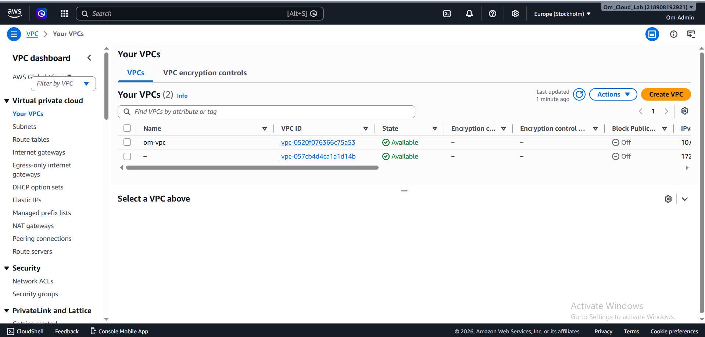
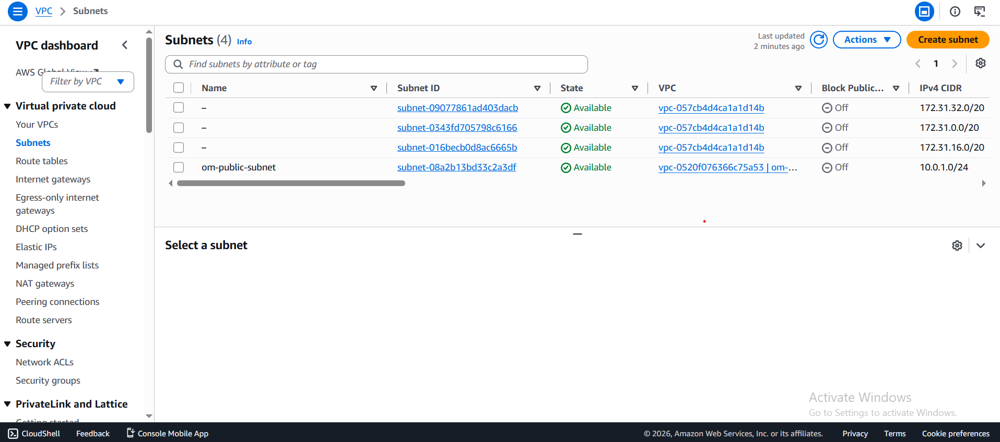
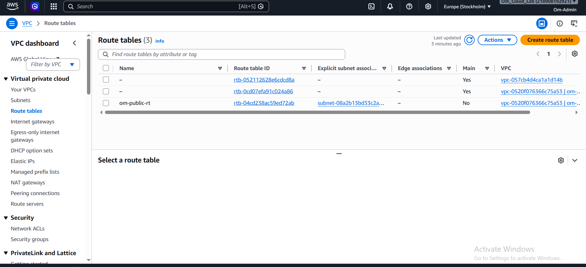
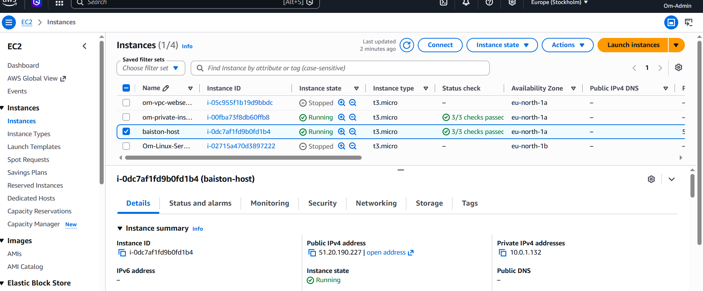
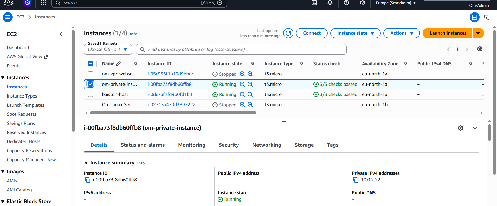
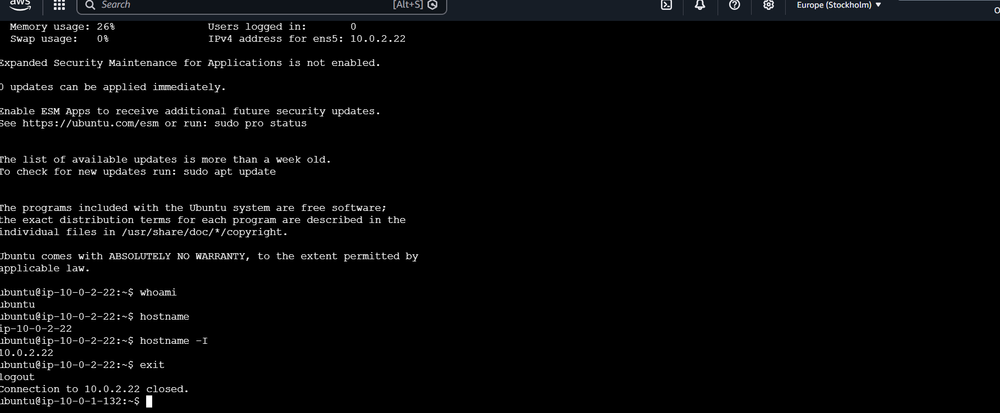
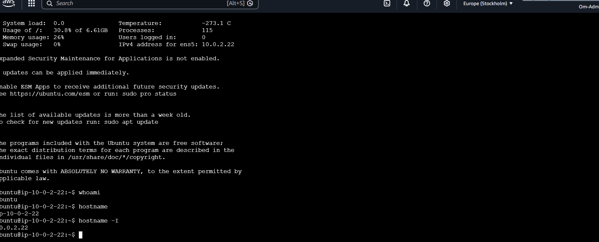
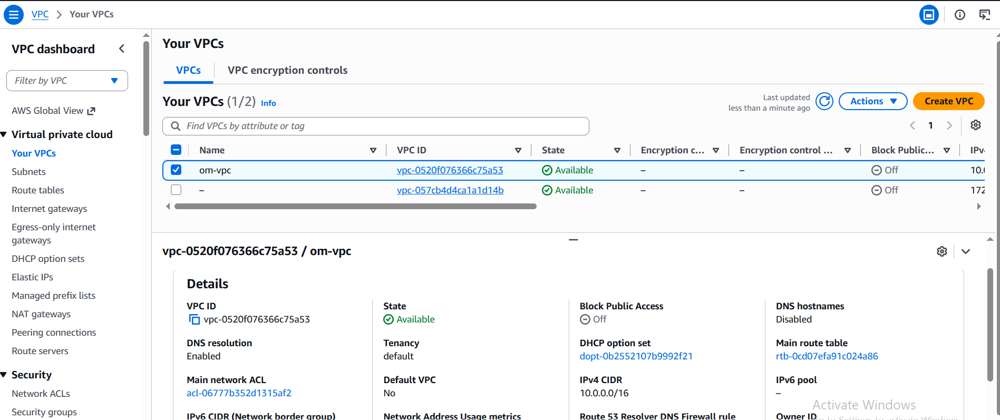

# Cloud Portfolio Website

A personal cloud portfolio website hosted on **AWS EC2** using **Ubuntu Linux** and **Nginx**.

This project is part of my hands-on cloud engineering learning journey. Instead of only studying cloud concepts, I am building and deploying real projects to strengthen my practical skills.

## Project Overview

This portfolio website is deployed on an AWS EC2 instance running Ubuntu. The web server is configured using Nginx, and the project is managed with Git and GitHub.

The objective of this project was to gain practical experience with cloud infrastructure, Linux administration, web hosting, and version control.
## 📸 Project Screenshots

### Portfolio Website


---

### AWS EC2 Instance


---

### GitHub Repository


## Technologies Used
* AWS EC2
* Ubuntu Linux
* Nginx
* HTML5
* CSS3
* Git
* GitHub
  
## Features
* Professional portfolio homepage
* Responsive layout
* AWS-hosted website
* Nginx web server configuration
* Version-controlled using Git
* Hosted on Ubuntu EC2

## What I Learned
* Launching and managing EC2 instances
* Connecting to Linux servers using SSH
* Installing and configuring Nginx
* Managing AWS Security Groups
* Understanding VPC basics
* Using Git and GitHub for version control
* Deploying and updating a live website

---

## Project Structure

```text
cloud-portfolio/
│
├── index.html
├── style.css
└── README.md

## Future Improvements

* Add HTTPS using SSL/TLS
* Add custom domain
* Add project screenshots
* Improve portfolio with additional cloud projects
* Automate deployment using GitHub Actions

## Author

Om Gaikwad
Aspiring Cloud & Cloud Security Engineer
Building practical cloud projects one step at a time.
Aspiring Cloud & Cloud Security Engineer

Building practical cloud projects one step at a time.


##  *Project 2*: Custom AWS VPC Web Server

This project extends the portfolio deployment by hosting it inside a custom AWS network designed from scratch.

### Infrastructure Built

* Created a custom VPC (`om-vpc`)
* Created a public subnet (`om-public-subnet`)
* Created and attached an Internet Gateway (`om-igw`)
* Created a custom Route Table (`om-public-rt`)
* Configured the default route (`0.0.0.0/0`) to the Internet Gateway
* Associated the Route Table with the public subnet
* Launched an Ubuntu EC2 instance inside the custom VPC
* Installed and configured Nginx
* Deployed the portfolio website successfully

### Skills Practiced

* AWS VPC
* Public Subnets
* Internet Gateway
* Route Tables
* Security Groups
* EC2 Networking
* Linux Administration
* Nginx Deployment
* Git & GitHub

### Key Learning

I learned how Internet traffic reaches an EC2 instance through a custom VPC using an Internet Gateway, Route Table, Public Subnet, and Security Group. I also deployed a live website inside infrastructure that I designed myself.

## Project 2 Screenshots





# Project 3 – Secure Bastion Host Access

## Objective

To securely access an EC2 instance deployed in a private subnet without exposing it directly to the Internet.

## Architecture

Laptop
↓ SSH using PEM Key
Bastion Host (Public Subnet)
↓ SSH using Private IP
Private EC2 (Private Subnet)

## AWS Services Used

* Amazon EC2
* Amazon VPC
* Public Subnet
* Private Subnet
* Internet Gateway
* Route Tables
* Security Groups
* SSH Key Pair

## What I Implemented

* Created a custom VPC.
* Configured separate public and private subnets.
* Deployed a Bastion Host in the public subnet.
* Deployed a private EC2 instance without a Public IP.
* Configured Security Groups to allow SSH only from the Bastion Host.
* Successfully connected:

  * Laptop → Bastion Host
  * Bastion Host → Private EC2

## Key Learning

* Difference between Public and Private Subnets.
* Why private EC2 instances should not have a Public IP.
* Purpose of a Bastion Host in secure cloud environments.
* How Security Groups control communication between instances.
* Practical SSH access using a Bastion Host.

## Challenges Faced

* SSH connection timeout due to Security Group configuration.
* Verified network path and instance placement.
* Corrected Security Group rules.
* Successfully established secure SSH access to the private EC2.

## Outcome

Successfully implemented a secure AWS network architecture where administrative access to a private EC2 is provided through a Bastion Host instead of exposing the server directly to the Internet.

## Project 3 Screenshots





